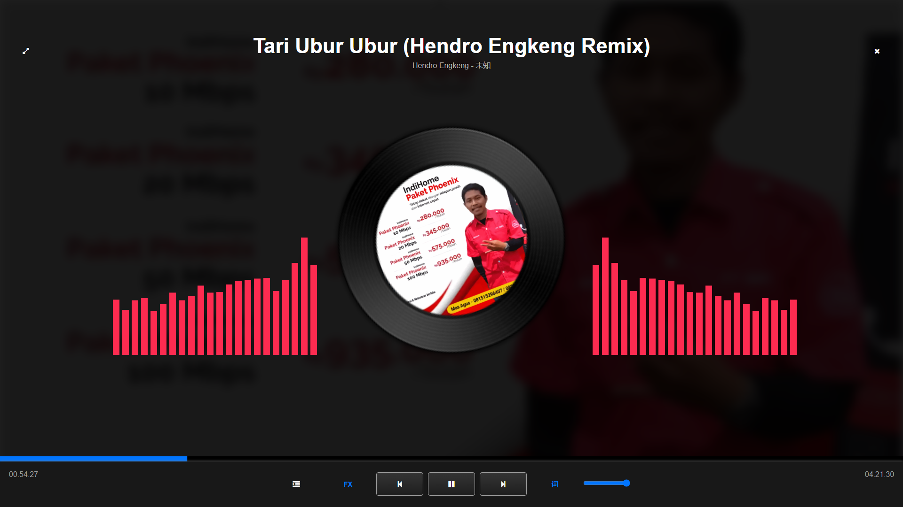

# QLYAudioPlayer-Demo



网页音乐播放器，包含歌词显示，频谱图效果等功能,

Demo:https://notf-api.github.io/audio-player-demo/index.html

版本:v0.5.4 更新日期:2021/9/2

学习通学生课堂参加作品

本项目图片，音乐资源仅供学习交流使用，如有侵犯请联系删除。

# 使用方法

在js/demoPlayList.js中按demo的格式填写歌曲信息并添加到demoPlayList中

```js
{
        title:"Tari Ubur Ubur (Hendro Engkeng Remix)",
        description:"",
        artist:"Hendro Engkeng",
        album:"未知",
        musicSrc:"audio/Tari Ubur Ubur (Hendro Engkeng Remix).mp3",
        lyricSrc:null,
        coverImageSrc:"image/Tari Ubur Ubur (Hendro Engkeng Remix).jpg",
        themeColor:"#fd2b50",
        backgroundSrc:"image/Tari Ubur Ubur (Hendro Engkeng Remix).jpg"
}
```

+ title:歌曲标题
+ description:歌曲描述
+ artist:歌手/作曲家
+ album:专辑信息
+ musicSrc:存放歌曲mp3/m4a文件的相对路径
+ lyricSrc:存放歌曲歌词src的路径
+ coverImageSrc:存放封面图片的路径
+ themeColor:主题色，决定了本歌曲的频谱图颜色
+ backgroundSrc:背景图片路径

使用Nginx或Live Server，访问index.html即可访问页面

# 兼容性

Chrome 96.0.4664.110/Firefox 94.0.2  Win10 x64 1920*1080 100%缩放比下通过测试，但仍有不少BUG

为避免不必要的兼容性问题，IE会直接退出页面

# 缺陷

+ 对不同显示缩放兼容效果不佳
+ 未对移动端提供支持
+ 切换歌曲/拖动进度条时可能会使歌词信息错乱

# 更新记录

v0.5.4:
1.修改XMLHTTPRequest为异步，font-awesome库更改为通过CDN加载

v0.5.3:
1.修改歌词解析，修复了一个可能会导致歌词时间线错乱的BUG

先前版本未做记录，请见谅

# 特别鸣谢

+ Klenkiven https://github.com/klenkiven
+ MINGYUAN-W https://github.com/MINGYUAN-W

# 参考网站

+ 文档参考

https://developer.mozilla.org/zh-CN

+ Audio DOM文档参考

https://www.w3school.com.cn/jsref/dom_obj_audio.asp

+ Object.defineProperty

https://developer.mozilla.org/zh-CN/docs/Web/JavaScript/Reference/Global_Objects/Object/defineProperty

+ RequestAnimationFrame

https://blog.csdn.net/wangmx1993328/article/details/84106703


